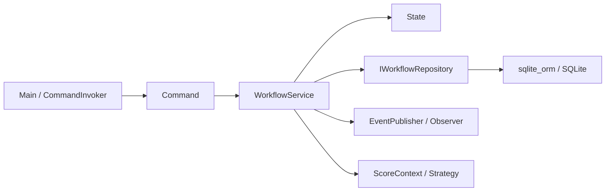
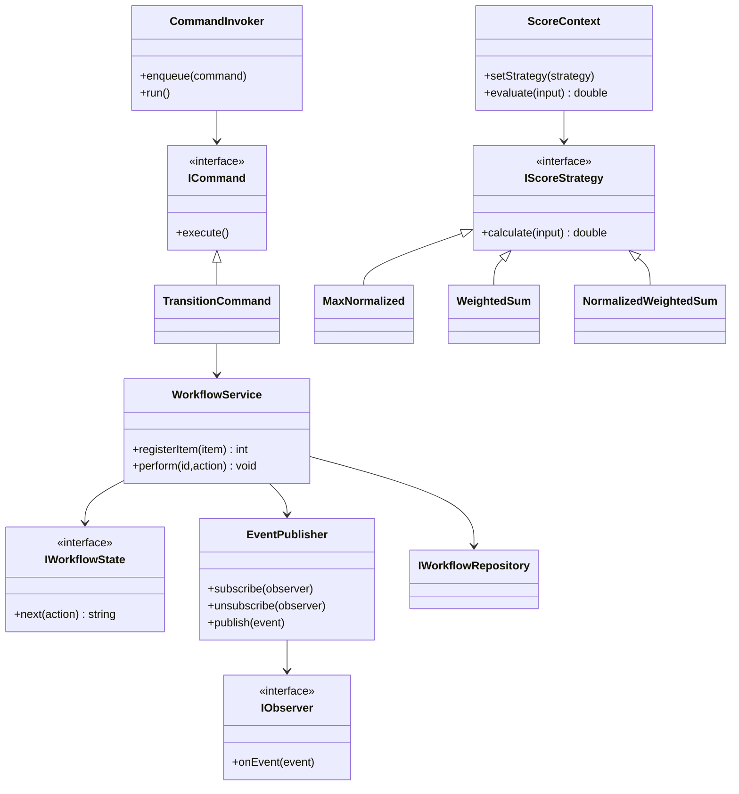
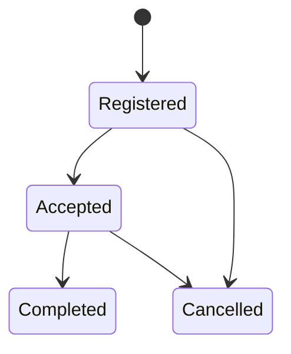

# Діаграми структури та взаємодії

## Інтеграція

```mermaid
flowchart LR
  UI[Main / CommandInvoker] --> CMD[Command]
  CMD --> SERVICE[WorkflowService]
  SERVICE --> STATE[State]
  SERVICE --> REP[IWorkflowRepository]
  REP --> ORM[sqlite_orm / SQLite]
  SERVICE --> OBS[EventPublisher / Observer]
  SERVICE --> STR[ScoreContext / Strategy]
```

## Структура патернів

```mermaid
classDiagram
  class IWorkflowState {
    <<interface>>
    +next(action) string
  }
  class WorkflowService {
    +registerItem(item) int
    +perform(id,action) void
  }
  class IScoreStrategy {
    <<interface>>
    +calculate(input) double
  }
  class ScoreContext {
    +setStrategy(strategy)
    +evaluate(input) double
  }
  class IObserver {
    <<interface>>
    +onEvent(event)
  }
  class EventPublisher {
    +subscribe(observer)
    +unsubscribe(observer)
    +publish(event)
  }
  class ICommand {
    <<interface>>
    +execute()
  }
  class CommandInvoker {
    +enqueue(command)
    +run()
  }
  class TransitionCommand
  class IWorkflowRepository
  WorkflowService --> IWorkflowState
  WorkflowService --> IWorkflowRepository
  WorkflowService --> EventPublisher
  IScoreStrategy <|-- MaxNormalized
  IScoreStrategy <|-- WeightedSum
  IScoreStrategy <|-- NormalizedWeightedSum
  ScoreContext --> IScoreStrategy
  EventPublisher --> IObserver
  ICommand <|-- TransitionCommand
  CommandInvoker --> ICommand
  TransitionCommand --> WorkflowService
```

## Стан залежної сутності

```mermaid
stateDiagram-v2
  [*] --> Registered
  Registered --> Accepted
  Accepted --> Completed
  Registered --> Cancelled
  Accepted --> Cancelled
```
